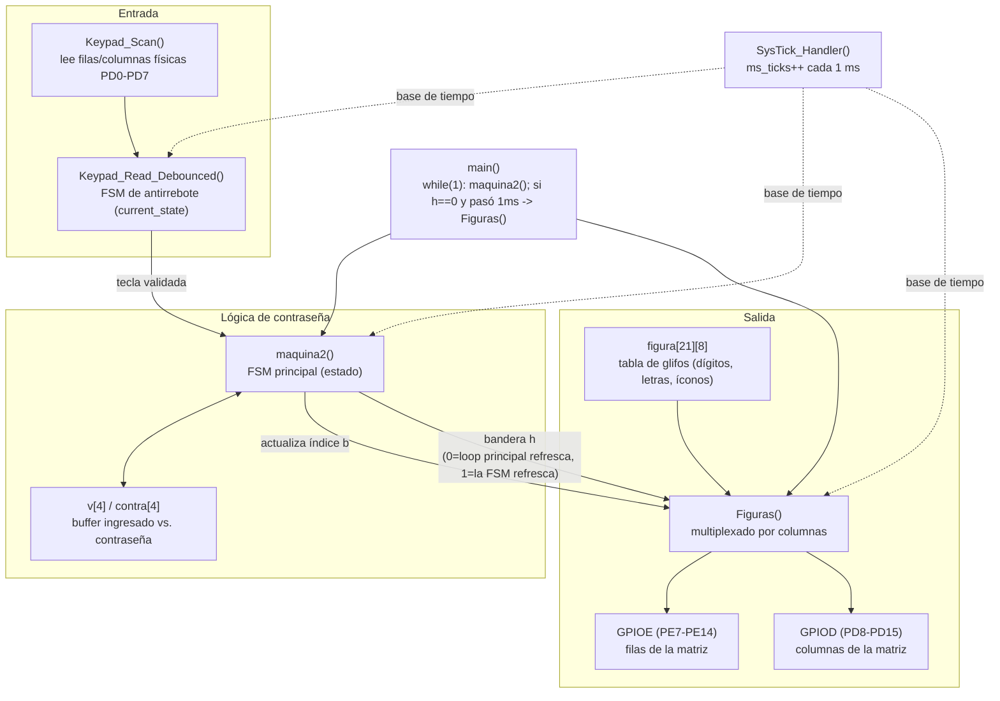
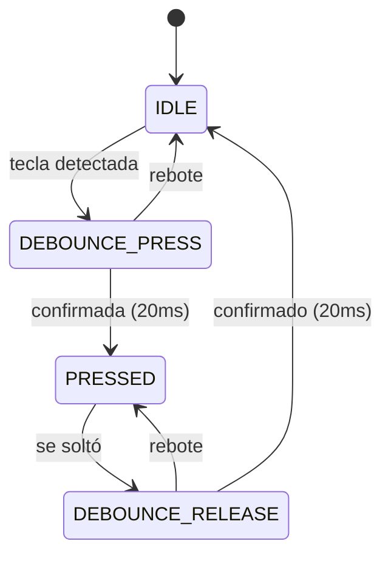
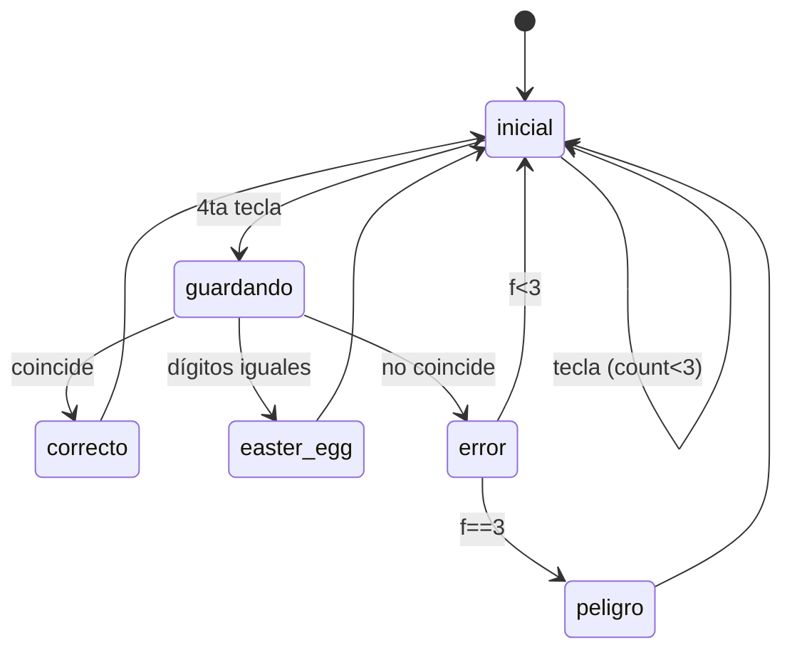

# Sistema de Contraseña con Teclado 4x4 y Matriz LED 8x8 — STM32F407VET6

Sistema de acceso por contraseña: el usuario ingresa 4 dígitos en un teclado matricial, y el resultado (correcto, error, modo peligro tras varios fallos, o un easter egg) se muestra como un ícono animado en una matriz de LEDs 8x8, multiplexada por columnas.

---

## 1. Código fuente

```
/
├── src/
│   └── main.c        # Programa completo (Pins_Init, Keypad_Scan, máquinas de estado, Figuras)
└── README.md
```

El proyecto es un único archivo `.c`, compilable directamente para STM32F407VET6 (usa `stm32f4xx.h` / CMSIS, sin HAL).

---

## 2. Diagrama de arquitectura

El sistema se organiza en tres capas: **entrada** (teclado, con su propia máquina de antirrebote), **lógica** (la máquina de estados de la contraseña), y **salida** (la matriz, multiplexada). Ninguna capa accede al hardware de otra directamente — todo pasa por las variables compartidas `b` (qué glifo mostrar) y `h` (quién controla el refresco de pantalla en este instante).



**Por qué existe la bandera `h`:** mientras se está escribiendo la contraseña (`h=0`), el refresco de la matriz lo dispara el `main()` cada 1 ms. Pero al mostrar un resultado (correcto/error/peligro/easter egg), la propia `maquina2()` necesita refrescar la matriz a su propio ritmo mientras cuenta los segundos que el ícono debe permanecer visible — por eso toma el control (`h=1`) y llama a `Figuras()` directamente, devolviendo el control al `main()` (`h=0`) cuando termina.

---

## 3. Diagramas de estado

### 3.1 FSM de antirrebote del teclado (`KeypadState_t`)



### 3.2 FSM de la contraseña (`State`)



| Estado | Glifo (`b`) | Duración |
|---|---|---|
| correcto | 18 | 3 s |
| error | 17 | 3 s |
| peligro | 19 | 10 s |
| easter_egg | 20 | 3 s |

---

## 4. Tabla de conexión

| Dispositivo | Señales | GPIO utilizado |
|---|---|---|
| Teclado | Filas F0–F3 | **PD0 – PD3** (salida, activas en bajo durante el escaneo) |
| Teclado | Columnas C0–C3 | **PD4 – PD7** (entrada, pull-up interno activado) |
| Matriz | Filas F0–F7 | **PE7 – PE14** (salida push-pull) |
| Matriz | Columnas C0–C7 | **PD8 – PD15** (salida push-pull) |

**Nota importante de diseño:** el teclado y la matriz comparten el puerto **GPIOD**, pero en bytes distintos — el teclado usa el byte bajo (bits 0-7) y la matriz usa el byte alto (bits 8-15). Esto es intencional y correcto (no hay conflicto eléctrico), pero vale la pena documentarlo explícitamente porque no es evidente a simple vista al ver `RCC->AHB1ENR` habilitando "GPIOD" una sola vez para ambos usos.

---

## Observación menor sobre el código (no bloquea la entrega)

En `maquina2()`, la variable local `char tecla;` no se inicializa, y solo se le asigna un valor cuando `h==0`:

```c
char tecla;
if(h==0) tecla = Keypad_Read_Debounced();
```

Cuando `h==1`, `tecla` queda sin inicializar. En la práctica esto **no causa un bug real**, porque el diseño de la máquina de estados garantiza que `h` solo vale `1` cuando `estado` está en `estado_error`, `estado_correcto`, `estado_peligro` o `easter_egg` — ninguno de esos `case` lee la variable `tecla`. Aun así, es una buena práctica inicializarla explícitamente (`char tecla = '\0';`) para eliminar cualquier ambigüedad de comportamiento indefinido a ojos del compilador, y para que el análisis estático de tu IDE no lo marque como advertencia.
